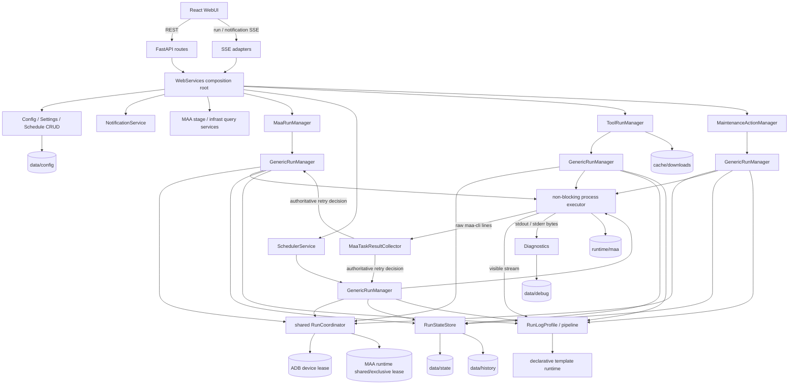

# Maa Auto Panel 后端与全项目架构审计

状态：基于当前工作树的完整审计

审计日期：2026-07-14

来源会话：`2026-07-14_2057-full-code-audit`

## 结论摘要

项目已经拥有一套边界基本正确的通用运行内核，并非简单的 `maa-cli` 命令包装器。当前最值得保留的是：外部进程执行、run/retry 状态机、资源协调、结构化日志、持久历史和 SSE 增量协议已经彼此分层；MAA 结果判定也没有依赖可见日志模板。

当前没有 P0。最重要的风险是：

1. scheduler 只匹配轮询瞬间的当前分钟，停机、卡顿或重启跨过该分钟会永久漏执行。
2. APK manifest 损坏仍会静默退化为空状态，且 APK 下载/安装缺少 hash、包身份和签名证书校验。
3. 资源等待中的 run 在应用关闭时可能被标为 failed，而不是 stopped。
4. open retry 没有持久 checkpoint，崩溃会丢失当前 retry 的结构化日志和 attempt 元数据。

主要结构债务不是需要数据库、微服务或动态插件系统，而是 MAA 手动/定时执行重复、`MaaRuntime` 聚合对象传播过广、通用 run contracts 存在尚无生产调用方的扩展点，以及 strict/tolerant 模板加载器的双轨实现。

## 完整架构示意



### 前后端与 API 边界

- FastAPI route 只负责请求模型、语义异常映射和调用服务；共享 run control route 已统一 current/SSE/stop/force-stop。
- `WebServices` 是当前 composition root，构造四类领域入口和四个 `GenericRunManager`，并共享一个 `RunCoordinator`、一个 `RunStateStore` 和一套 diagnostics。
- 浏览器通过 REST 获取配置与历史，通过 retry-aware SSE 接收 reset/patch。服务端 run/retry 是权威状态，前端不自行推演执行结果。
- 通知使用独立 SSE；近期事件是进程内 100 条有界队列，Toast 只是投递策略，不承担历史存储。

### 运行内核

```text
领域服务构造 RunStartPlan
  -> GenericRunManager 建立 durable run + live state
  -> worker 建立 retry
  -> on_start / before_run
  -> RunCoordinator 获取资源 lease
  -> build_command
  -> process executor 流式执行、超时、stop/force-stop
  -> 领域 evaluate_attempt 产生 RetryDecision
  -> seal retry + durable retry history
  -> retry 或 durable-first 提交 run 终态
  -> retention / notification best effort
```

- `GenericRunManager` 拥有线程、锁、retry loop、stop、资源申请时序和终态提交；它不按 manual/schedule/tool/maintenance 或 MAA 分类分支。
- `RunCoordinator` 以资源 `(kind, identifier, shared/exclusive)` 冲突，而不是全局串行化。MAA run 共享 runtime、独占设备；维护更新独占 runtime。
- process executor 使用非阻塞二进制 fd、独立增量 UTF-8 decoder 和有界 partial line，支持 process group SIGTERM/SIGKILL。
- durable run 终态先写盘再发布 live/SSE；retention 和通知在终态之后隔离执行。

### MAA integration

- `MaaRuntime` 当前组合 application/framework/cache/MAA installation 路径，并提供 maa-cli 环境。
- 手动和定时 MAA run 都生成隔离的临时任务配置，通过 `maa-cli run --batch` 执行。
- 原始 stderr 同时送入 `MaaTaskResultCollector`；任务 Start/Completed/Error/Stopped 是成功判定依据。
- 可见日志走独立的 source preprocessor、通用 pipeline 和 TOML template runtime。模板失效会使用局部容错、last-known-good 或 plain fallback，不能改变 run 成败。
- MaaCore `asst.log` 由 MAA 领域按 retry 增量捕捉；通用 diagnostics 不知道 MaaCore 路径。

### 日志与持久化

```text
data/
  config/framework/       framework settings、schedule、scripts、notifications
  config/maa/             maa-cli 可编辑配置
  state/framework/        recent run/retry index、scheduler trigger/stats
  history/framework/      retry-scoped structured visible logs
  debug/framework/        framework.log、events、stdout/stderr、增量捕捉
runtime/maa/               maa-cli、MaaCore、资源、XDG state、generated configs
cache/downloads/           可重建 APK / patch cache 与 manifest
ADB credentials            独立持久边界，不扩展为整个 HOME
```

- 持久引用使用 `framework:`、`runtime:`、`downloads:` 逻辑根，避免部署绝对路径进入 durable state。
- run 是 retention ownership 单元；历史、diagnostics 和显式 owned artifact 随 run 淘汰，unknown/shared artifact 不级联删除。
- 当前 JSON store 是有界、文本可读且适合单实例规模的选择；不建议仅因文件存储而引入数据库。

### 部署与产品边界

- 当前 systemd/裸机运行是开发方式；目标容器边界为单 panel、普通 bridge、外部 TCP redroid、非 privileged、专用 UID/GID。
- `data`、可在线更新的 `runtime/maa`、download cache 和 ADB credentials 是四个独立持久化边界；应用镜像更新不能强制绑定 MAA runtime 更新。
- systemd/dev 与 Compose 实例不得同时连接同一设备或共享持久根。scheduler、coordinator 和 file stores 都是进程内/单实例模型，不支持多副本或滚动双实例。
- 产品威胁模型是可信内网、单用户。当前不需要登录、token、RBAC、用户数据库或认证反代；若网络/多租户前提变化，应单独重审。
- 当前不需要数据库、微服务或动态第三方 Python plugin loader。优先用进程内 registry 和第二 integration 验证边界。
- 隔离容器曾发现官方 stable runtime 的 OpenCV SONAME 混合风险；`maa version` 不会加载所有设备 plugin，不能替代真实设备 smoke，也不能用伪造 symlink 掩盖依赖问题。

### 模块职责图

| 边界 | 当前模块 | 判断 |
|---|---|---|
| 应用装配/关闭 | `web/app.py`, `web/services.py`, `cli.py` | 边界正确，但 manager 清单仍手工重复 |
| 通用执行 | `run_manager/`, `process.py`, `run_resources.py` | 核心复用良好，manager 文件过大且 contracts 有冗余 |
| 日志 | `logs/`, `logs/templates/` | 分层清楚；strict/tolerant loader 维护成本偏高 |
| MAA 领域 | `maa/` | 专项逻辑大体留在正确边界；手动/定时 adapter 重复明显 |
| scheduler | `scheduler/` | policy/time/state 有拆分；service 同时承担触发器和 MAA adapter |
| 配置/存储 | `config/`, `storage/`, `paths.py` | 路径所有权明确；部分 manager 仍依赖完整 `MaaRuntime` |
| 工具 | `tools/` | 有轻量 registry，但表单协议和资源策略仍由单一 game-update 塑形 |
| Web | `web/routes/`, `web/sse.py` | routes 薄且共享控制器合理 |

## 当前问题

### P1：scheduler 会永久漏掉错过的分钟

`scheduler/service.py:461-495` 每 15 秒轮询一次，并只接受 `entry.time == now.strftime("%H:%M")`。首次扫描还要等待 15 秒；服务停机、事件循环/文件读取卡顿、机器 suspend，或在目标分钟内持续被其他 run 拒绝，都会在分钟变化后永久丢失该次触发。代码没有 last-scan cursor、due window 或补偿扫描。

建议把“应触发实例”建模为 `(schedule_id, entry_id, game_day, scheduled_at)`：持久保存上次成功扫描时刻，启动及每轮扫描 `(last_scan, now]` 内的 due instances，再用 trigger store 幂等去重。对过久欠账设置明确 grace window，避免服务恢复后无限补跑。

### P1：APK manifest 损坏可被覆盖，下载物缺少身份校验

`tools/game/update.py:53-59` 捕获所有异常并把损坏 manifest 当作 `{"packages": {}}`。下一次状态更新会覆盖原文件，这与其他 durable state 的 fail-closed 规则相反，也会遗留失去引用的 cache。

同一链路只验证 HTTP、Content-Length 和安装后 versionCode；没有校验下载 hash、APK package name、签名证书或来源声明。直接写最终文件名也没有 `.part + fsync + atomic rename`。

建议先将 manifest 改为严格 object/schema 读取，损坏时隔离并停止破坏性写入；下载使用临时文件并记录 SHA-256、size、URL、package name、signing certificate digest 和验证时间。安装前后都核对期望 package/certificate，而不只比较版本号。

### P1：资源等待中的 run 在 shutdown 时可能错误失败

`web/services.py:71-79` 先关闭 coordinator，再向 manager 发 stop；`run_manager/coordinator.py:95-99` 在 closing 时抛普通 `RuntimeError`，且检查顺序早于 `should_cancel`。等待线程可能先醒来进入 manager 的通用异常路径，留下 failed，而不是 shutdown 语义的 stopped。

建议 coordinator closing 抛专用 cancellation 异常，或先对所有 manager 设置 stop_requested，再关闭 coordinator；增加“等待资源时关闭应用”的 manager 级回归测试。

### P1：open retry 崩溃恢复粒度不足

retry 只在 seal 时由 `RunStateStore.add_retry()` 落盘。进程崩溃时，当前 retry 的可见日志、summary、metadata 和 artifact 引用会丢失，启动恢复只能把 run 从 running 封为 stopped。

建议按 generation/时间节流写原子 open-retry checkpoint；恢复时将其封为 stopped/recovered。不要在每条日志上同步全量写盘。

### P1：scheduler 业务计数与 retry 持久化不是同一提交边界

`scheduler/service.py:181-190` 在 `evaluate_attempt` 中先更新 daily stats，之后 manager 才 seal/persist retry。若随后 retry 持久化失败或进程崩溃，daily stats 已计数但历史中没有对应 retry；反向失败也可能产生 history 与 stats 不一致。

建议把 scheduler side effect 移到 retry durable commit 之后的幂等 callback，使用 retry id 作为去重键；trigger 标记也应与 run 创建建立可恢复的 reservation，而不是只靠 `_start_run()` 返回后再写。

### P2：run contracts 的类型边界已损坏

Ruff 当前报告 11 个错误。`run_manager/manager.py:145` 使用未导入的 `Callable`；`contracts.py:15-23` 引用并未定义在该模块的 `RunAttempt`/`RunCallbackAPI`。普通运行因 postponed annotations 没有立即失败，但 `typing.get_type_hints()` 已可稳定复现 `NameError`，会阻碍静态检查、文档生成和后续框架化。

建议把领域可见的 `RunAttempt`/callback API 放进独立 contract/context 模块，或用无环的 Protocol；CI 固定运行 Ruff，避免“测试通过但类型命名空间损坏”。另有 `notifications/service.py` 的未使用 `Path` import。

### P2：手动与定时 MAA adapter 重复

`maa/runner.py:157-299` 与 `scheduler/service.py:63-259` 重复维护：task descriptor、collector、MaaCore offset、命令构造、模板 task sequence、attempt status、diagnostic capture、retry summary 和 retry 文案。差异主要是任务选择 policy、profile 来源、缓冲等待、daily stats 和 final status。

建议抽出 MAA 领域内的 `MaaAttemptExecutor`/`MaaAttemptSession`，统一“准备命令—收 raw result—捕捉 diagnostics—形成 attempt facts”；manual/schedule 只提供 task selection 和 retry/final policy。不要把这些 MAA 语义下沉进 `GenericRunManager`。

### P2：通用运行内核含未被生产使用的扩展点

当前没有生产代码配置 `RunCallbacks.before_attempt`、`RunCallbacks.on_finish`、`RunScriptHooks.after_run`、`RunScriptHooks.after_retry`、`RetryDecision.next_command` 或 `RunCompletion.metadata_patch`；`RunTextTemplates.retry_limit_reached` 也没有非空生产值。`after_attempt` 虽被使用，但 manager 用 `RetryDecision` 重新伪造 `StreamingProcessResult`，丢失真实 `timed_out/forced`，两个现有 callback 因此都刻意忽略 `_result`。

项目尚未发布且不保留前向兼容。建议删除没有当前用例的 hooks，或在出现第二个真实 integration 时再按实际需求加入；把 `after_attempt` 简化为 `(attempt, decision)`，或传递真实 process result，不能保留语义失真的参数。

### P2：`MaaRuntime` 仍是跨领域 service locator

通用 run/store/diagnostics 已脱离 MAA aggregate，但 config、framework settings、notification settings、scheduler state/scripts/config、tools 和所有 MAA service 仍有 14 个模块依赖 `MaaRuntime`。例如 scheduler state 只需要 `FrameworkPaths`，notification settings 只需要一个 config path，schema validator 只需要 application schemas。

建议在 composition root 拆入最窄依赖：`ApplicationPaths`、`FrameworkPaths`、`CachePaths`、`MaaInstallation`、`PathReferenceResolver` 和显式 process environment factory。先收窄 framework-owned manager；MAA 领域可以继续接收一个 MAA integration context。

### P2：模板 strict/tolerant loader 是双轨 schema 实现

`logs/templates/loader.py` 同时维护 `load_*` 和 `tolerant_*` 的 fields/lookups/rules/boundaries/blocks 遍历。核心 item parser 已部分复用，但新增 key 或 fragment 类型仍需同步两套容器逻辑，容易发生 strict/runtime 行为漂移。

建议保留 strict 与 tolerant 两种策略，但统一成一个 parser 和可配置 error collector：strict 在首错抛出，tolerant 收集诊断并跳过当前 fragment。不要把模板重新移回 MAA Python 专用规则。

### P2：composition 与 action 分类仍手工枚举

`WebServices._run_managers()`、route 装配、history kind filter 和通知映射手工知道四类 run。`ToolRunManager` 虽有 `_specs`，但 default config、resource policy 和表单字段仍按 `game-update` 分支。

下一阶段适合建立进程内 `ActionSpec`/`IntegrationSpec` registry，统一 id、标题、run kind、表单 schema、资源、plan builder、通知和 route exposure。先用第二个 integration/工具验证，不需要动态加载第三方 Python 插件。

### P3：其他清理

- `GenericRunManager` 975 行，状态机本身合理，但 process bridge、script hooks、persistence finalization 和 live/SSE mutation 可按职责拆成内部协作者；不要拆成互相回调的细碎 service。
- `ADBDevice.get_apk_path()`、`pull_file()` 当前无生产或测试引用，可删除，等真实工具需要时再引入。
- `settings` PUT 顺序写四个文件，单个 I/O 失败会形成部分保存。可先写全部临时文件再统一 replace，或拆成独立资源 endpoint。
- `NotificationSettingsManager.response()` 返回绝对路径，而其他持久路径使用逻辑/相对引用；应统一展示语义。
- `architecture-direction.md` 仍包含早期目标结构和已过时的“未来”描述，后续应把它收敛为纯方向决策，当前事实以本审计为准。

## 测试套件审计

### 当前基线

- `pytest --collect-only`：142 cases。
- 全套执行：142 passed，约 8–10 秒。
- coverage：总计约 74%。run coordinator/store/log template 较高；scheduler service 46%、MAA runner 49%、game updater 30%、stage service 32%、maintenance 39%。
- 前端没有正式自动测试套件。

结论：测试数量不构成速度负担。应减少重复搭建和历史实现细节锁定，但不能为了把数字降到 100 以下而删除并发、持久化、stop/timeout、corrupt-state 等高价值路径。

### 可以直接删除或并入相邻测试

1. `test_backend_utilities.py::test_scheduler_force_stop_terminal_current_run_is_idempotent`：只验证一行 forwarding wrapper，语义已由 `LiveRun` terminal force-stop 和通用 manager stop 测试覆盖。
2. `test_run_state_and_diagnostics.py::test_run_state_store_records_single_attempt_for_generic_runs`：与同文件的 readable-state/history 测试大段重复，可把 stopped/summary 两个断言并入前者后删除。
3. `test_backend_utilities.py::test_live_run_retry_count_and_terminal_force_stop_are_stable`：建议把 retry_count 序列化断言移入 `run_manager/state` 的表驱动测试；若完成上述迁移，原测试可删除。
4. `test_backend_utilities.py::test_create_app_exposes_expected_api_paths`：目前只是脆弱的 route inventory。若为各 router 补最小 API contract tests，可删除；在此之前暂留。

净删除目标约 2–4 cases，不建议更多直接删除。

### 应汇总/重组，但保留行为覆盖

- 将 `test_backend_utilities.py` 拆回领域文件；它混合 config、process、tool、scheduler、app logging，fixture 大量重复且难发现覆盖关系。
- 合并 diagnostics incremental 的“正常/空增量/缺失/截断”为一个状态转换测试。
- 用共享 `runtime/diagnostics/store/manager` fixtures 替代 run manager、command、shutdown 文件中的重复装配与 `_join/_wait_until`。
- MAA 日志 30 个函数中，把纯 TOML 输入→message 的翻译样例改为表驱动 fixture；模板 reload、fallback、source isolation、bounded tail 等状态机测试继续独立。
- coordinator 的 shared/exclusive/different-id 可用资源冲突 truth table 汇总；抢占、超时、不可抢占和 stop wakeup 继续独立。
- 将 manual/scheduled “空任务产生 sealed skipped retry”共享成同一 integration contract fixture，领域差异只保留各自断言。

这类重组可能把测试函数降到约 110–120，但 pytest parameter case 数未必明显下降；更重要的收益是测试代码行数和 fixture 维护成本下降。

### 不应删除的高价值测试

- partial output、UTF-8/CRLF、有界长行、runtime timeout、stop escalation、process-group descendant kill。
- durable-first terminal、短暂写失败重试、持续写失败 fail-closed。
- resource priority/preemption/shared-exclusive/等待超时/stop wakeup。
- corrupt durable state 不覆盖、path traversal、logical root relocation、run-aware retention ownership。
- SSE open retry replacement/cursor patch 和 shutdown disconnect。
- 模板局部容错、last-known-good/plain fallback、配置器失败不影响 run。

### 应新增后再谈进一步删减

优先补：scheduler missed-window/restart catch-up、shutdown while waiting for resource、scheduler stats 幂等、manifest corruption、APK identity verification、MAA manual/schedule 共用 executor contract。前端测试建议见 `FRONTEND_AUDIT.md`。

## 建议实施顺序

1. 修 scheduler due-window 与幂等 reservation，并补触发恢复测试。
2. 修 manifest fail-closed 与 APK 完整性/身份验证。
3. 修资源等待 shutdown 语义和 open-retry checkpoint。
4. 收敛 run contracts 的类型错误与未使用 hooks。
5. 抽取 MAA attempt executor，消除 manual/schedule 重复。
6. 统一 template loader error policy，随后收窄 `MaaRuntime` 依赖。
7. 以第二个 action/integration 验证轻量 registry。
8. 最后重组测试目录和 fixtures；不要把测试精简与上述高风险功能修复混成一次大改。

## 本次验证

- `.venv/bin/python -m pytest -q`：142 passed。
- `.venv/bin/python -m compileall -q src`：通过。
- `npm run build`：通过。
- `uvx vulture src tests --min-confidence 80`：无发现。
- `uvx ruff check src tests`：失败，11 项（1 个 unused import、10 个 undefined annotation/name）。
- coverage：7602 statements，约 74%。原始 coverage data 位于本会话 `scratch/.coverage`。

本轮是审计与文档/持久状态整理，不修改产品代码、不重启服务、不执行 Docker 或设备任务。
