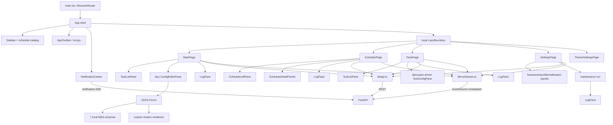

# Maa Auto Panel 前端审计

状态：基于当前工作树的完整审计

审计日期：2026-07-14

来源会话：`2026-07-14_2057-full-code-audit`（前端子代理：`frontend-audit`）

## 结论摘要

前端不需要重写。route/editor lazy boundary、retry-aware SSE patch、`LogPane`/`RunStopButton`、AlertDialog/Tabs/Accordion/Sheet/Sonner 等基础边界都值得保留。

当前最重要的问题是：工具页把“非当前选中工具的全局 active run”投影为 idle，错误开放第二次启动；七类 task editor schema/defaults/新增类型完全硬编码在前端；Main/Schedule/Settings 跨主路由会静默丢失草稿；并且没有正式前端测试。下一阶段应建立两个通用边界：`useLiveRun` 和服务端 action/editor descriptor，而不是继续在页面中复制专项逻辑。

## 完整前端架构示意

### 状态与数据边界

- `App` 保留 shell、sidebar、notification center 和 route lazy load；各业务页面卸载时其局部 draft 也随之销毁。
- `lib/api.ts` 手写 endpoint functions，`lib/types.ts` 手写约 500 行 wire types；后端大量 response 是 `dict[str, object]`，OpenAPI 暂不能生成精确类型。
- `lib/runStream.ts` 负责 reset/patch 合并，但四个页面分别实现 snapshot、EventSource、reconnect error 和 cleanup 生命周期。
- Main task config 在页面内维护 per-config drafts；Schedule/Settings 各自维护单份 draft。
- JSON Forms editor 只在选中 task item 时加载，七类 MAA schema 与 UI field groups 编入独立 editor chunk。
- 动态 option 默认是受限 Select；schema 可用 `x-allowCustom` 将 option 降为推荐集，由通用可创建选择器同时提供搜索、标准值选择和原样自定义输入。Fight 关卡计划使用该模式，因此远端列表失败或缺项时仍可编辑。

### UI primitive 使用判断

已正确使用组件库的部分：

- 确认框：shadcn/Radix AlertDialog。
- retry 折叠：Radix Accordion。
- 配置/统计切换：Radix Tabs。
- 通知：Sheet + Sonner。
- Select、Checkbox、Tooltip、ScrollArea、Button、Card：现有边界合理。

不应误判为“手搓组件”的部分：`PrimitiveArrayEditor`/领域列表的 sortable 行为、schedule 可调分隔布局。Radix 本身没有 sortable/resizable primitive；若补键盘排序应统一采用成熟 sortable 库，而不是继续堆自制按键分支。

## 当前问题

### P1：切换工具后错误开放第二次运行

`ToolsPage.tsx:77-80` 用 `runForTool()` 将不属于当前选中工具的 global run 显示为 idle；`handleRun()` 只检查 selected tool/busy；`ToolConfigPane.tsx:23-66` 又只依据这个过滤后的 run 禁用表单和按钮。

因此工具 A 正在运行时选择工具 B，B 会重新显示“运行”可用并发送第二次 start；后端虽会拒绝，但 UI 已违反单 manager 的全局 active 约束，且停止按钮也随过滤消失。

修复原则：显示日志可以按 tool 过滤，动作权限必须使用未过滤的 global manager state。通用 hook 应明确返回 `globalActive` 和 `visibleRun`，不能用一个投影对象同时表达二者。

### P1：task editor registry 完全前端硬编码

`lib/taskSchemas.ts` 静态登记七类 MAA task；`taskItemDefaults.ts`、`config/task-item-defaults.json` 和 `TaskListPane` 又分别维护新增类型、中文名和默认 params。schema、general/advanced 分组、动态 option source 与后端/maa-cli 领域知识重复。

未知 task 可以读入，但只能显示“没有接入模板”，不能编辑 params。第二 integration 或新增 MAA task 都要求改前端 bundle。

建议建立服务端 editor descriptor：`integration/type/title/defaults/schema/uiSchema/optionsSource`。前端只保留通用 renderer registry；MAA 专用 descriptor 留在 MAA integration。先迁移现有七类，再用第二 integration 验证，不要继续加入第八份静态 import。

### P1：跨主路由静默丢失未保存草稿

Main、Schedule、Settings 的 draft 都只存在对应 lazy page state。`DirtyActions` 只显示保存/复位，没有 Router blocker 或 `beforeunload`。从主任务切到定时/工具/设置会卸载页面并丢失草稿。

建议抽 `useUnsavedChangesGuard(dirty)`，组合 router blocker、`beforeunload` 和现有 AlertDialog。若选择保留跨路由草稿，则将 workspace state 提升到 App 外层；二者至少实施一项。

### P1：没有前端自动测试

`package.json` 没有 test script，仓库也没有前端测试文件。build 只能证明类型与打包，不覆盖 SSE reconnect/patch、draft 合并、工具 global active、通知去重和动态 option fallback。

优先为 `runStream.ts`、task workspace、工具 run projection 和 bounded notification ids 写纯测试；再用少量 Playwright 覆盖 dirty navigation、工具切换禁用和 SSE reset/patch/reconnect。EventSource 页面不得等待 `networkidle`。

### P2：四份重复 SSE 生命周期

Main、Schedule、Tools、Settings 基本逐行重复：GET snapshot、构造 cursor URL、创建 EventSource、JSON parse/apply、error 和 cleanup。stop/busy/parse error 策略已出现差异。

建议抽 `useLiveRun({getSnapshot, eventsUrl, connectionError})`，只处理 opaque RunState 协议；领域 action request 留在页面或薄 `useRunActions`，不要做识别 manual/schedule/tool 的巨型 hook。

### P2：通用 LogPane 从中文日志反解析 MAA 状态

`pages/main/LogPane.tsx:171-188` 搜索“选择战斗关卡:”和“选择基建计划:”构造运行详情。模板改词或 integration 改变会静默失效，也让通用组件包含 MAA 专用中文。

建议后端将 selection 写入 typed metadata/artifact/detail descriptor；`LogPane` 只渲染结构化详情，不解析人类日志。

### P2：Profile 字段重复两份

`components/ProfileEditor.tsx` 与 `pages/settings/panels.tsx` 基本逐字段复制 connection config、ADB path/address、touch mode、OCR 和 checkbox。

建议提取无 panel 的 `ProfileFields`，Schedule 的 `ProfileEditor` 与 Settings 的 `DeviceSettingsPanel` 组合它；保留不同外层容器和 validation/path 信息。

### P2：Tool descriptor 是半实现契约

后端和前端 types 都声明 `ToolField.kind` 与 `ToolDefinition.description`，但 `ToolConfigPane` 对所有字段无条件渲染 text Input，也不展示 description。新增 number/select/boolean 或危险动作时会出现“契约声称支持、UI 实际忽略”。

若短期只有 text，应删除 `kind` 并展示 description；若马上实现公招/牛杂，定义受控 field union（text/number/select/checkbox、options/min/max/side-effect/retry policy）和 renderer registry。高风险工具的 retry/确认策略必须是 descriptor 的一部分。

### P2：通知运行期 Set 无界增长

recent events 有 100 条上限，localStorage 写入截到 500，但 `readIds`、`deletedIds` 和 `toastedIds` 的内存 Set 只增不减。长期打开页面会无界增长。

建议统一 bounded id set，或用服务端单调 sequence 水位替代永久保存每个 toasted id。

### P2：schedule sidebar 缺少 mutation invalidation

App 只在 pathname 变化时刷新 schedule catalog。原地重命名当前 schedule 后 pathname 不变，sidebar 可长期保留旧名称。

建议建立共享 catalog query/invalidation，或至少在 SchedulePage create/save/delete 成功后通知 App 刷新；不要用路由变化冒充数据 invalidation。

### P2：运行详情浮层应使用 Popover

`LogPane` 当前用 absolute div + boolean 自制浮层，没有 outside click、Escape、focus management 或 popover semantics，并可能被 overflow 裁剪。

使用项目 shadcn 配置加入 Popover；领域代码只提供 detail rows。这是本轮发现的明确“已有组件库 primitive、当前却手搓基础交互”的位置。

### P2：wire contract 主要靠手写宽类型

`api.ts` 手写所有 endpoint，`types.ts` 手写后端 dict/dataclass 镜像，关键 payload 又大量退化成 `Record<string, unknown>`。契约漂移多半只能运行时发现。

先给 RunState patch、ToolDefinition、Settings/Schedule 等高价值 endpoint 加明确 response model/discriminated union，再生成 TS wire types；前端 draft/view model 仍保持独立，不必一次生成全部内部类型。

### P3：死代码与静态检查缺口

- `lib/usePolling.ts` 无引用，可直接删除。
- `taskSchemas.ts` 返回的 `generalKeys`/`advancedKeys` 无消费者，可删除。
- `SchedulePage.tsx` 的 `cn` import 未使用；`tsc --noUnusedLocals --noUnusedParameters` 可稳定发现。
- schedule overview Card 只绑定鼠标 `onClick`；应使用 Router `Link/NavLink`，而不是自补 role/键盘分支。
- Radix direct packages 与 umbrella `radix-ui` 混用。不是当前 bug，下一次 shadcn 更新时统一生成风格即可。

## 推荐实施顺序

1. 修 tool global active、动态 select fallback、schedule Link 和明确死代码。
2. 加前端测试基础设施，先覆盖上述 correctness。
3. 抽 `useLiveRun`、bounded notification state 和共享 ProfileFields。
4. 加 dirty navigation guard；用 shadcn Popover 替换 RunDetails 浮层。
5. 设计服务端 action/editor descriptor，让 tools 与 task editor 复用 renderer registry。
6. 为高价值 API 建 response model 并逐步生成 TS wire types。

## 本次验证

- `npm run build`：通过；入口约 416.61 kB（gzip 133.22 kB），editor chunk 289.90 kB（gzip 94.29 kB），无 500 kB warning。
- `npm audit --omit=dev`：0 vulnerabilities。
- `npx tsc --noEmit --noUnusedLocals --noUnusedParameters`：仅报告 `SchedulePage.tsx` 未使用 `cn` import。
- 未启动服务、未修改前端业务代码。
